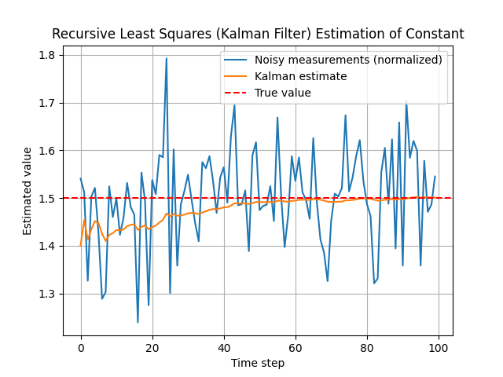

# 📦 Kalman Filter Project (C++ & Python)



This repository demonstrates the use of **Kalman filters** for both simulation and real-time applications, with a focus on:

- ✅ **C++** for high-performance simulation and CSV export
- ✅ **Python** for didactic simulations, analysis, and plotting

---

## 🧠 Features

- 📐 Discrete-Time Kalman Filter (DTKF) 
- 📉 Recursive Least Squares (RLS) Kalman filter 
- 📊 Export of C++ simulation results to CSV for further analysis
- 📈 Python utility script for plotting and comparing true, measured, and estimated states from CSV
- 🧪 Modular, testable C++ design

---

## 🔧 Dependencies

### ✅ C++ Dependencies

#### System Tools
- CMake ≥ 3.14
- C++17-compliant compiler (e.g. MinGW, MSVC)
- Ninja (recommended)

#### Libraries via [vcpkg](https://github.com/microsoft/vcpkg)

Make sure `vcpkg` is installed and its root is in your environment variable `VCPKG_ROOT`.

Install the required libraries:

```bash
vcpkg install eigen3:x64-mingw-static
vcpkg install glfw3:x64-mingw-static
```

> If you're using MSVC instead of MinGW, replace `x64-mingw-static` with `x64-windows`.

#### External Dependencies (imgui & implot)

ImGui and ImPlot are included for future/optional real-time GUI visualization. They are not required for basic simulation and CSV export.

To enable GUI features, clone them manually into your C++ project folder:

```bash
cd cpp
mkdir external
cd external
git clone https://github.com/ocornut/imgui
git clone https://github.com/epezent/implot
```

You should end up with:

```
cpp/
└── external/
    ├── imgui/
    └── implot/
```

---

### ✅ Python Dependencies

To run the Python simulations and plot C++ results:

```bash
# Create and activate a virtual environment
python -m venv venv
source venv/bin/activate      # On Linux/macOS
venv\Scripts\activate.bat   # On Windows

# Install required dependencies
pip install -r requirements.txt
```

This will allow you to run all the Jupyter notebooks, simulations, and the CSV plotting utility in `python/utils/plot_kalman_results.py`.

---

## 🛠️ Build Instructions

### 🛠️ C++

From the project root (`Kalman_Filter/`), run:

```bash
mkdir build
cd build

cmake .. ^
  -DCMAKE_TOOLCHAIN_FILE=$env:VCPKG_ROOT/scripts/buildsystems/vcpkg.cmake ^
  -DVCPKG_TARGET_TRIPLET=x64-mingw-static

cmake --build .
```


---

## 🚀 Running the Application

### C++ Simulation

```bash
./kalman_sim.exe
```

- Runs a simulation of a discrete-time Kalman filter on a pendulum system
- Saves results to `cpp/results/kalman_results.csv`

### Python Plotting Utility

After running the C++ simulation, plot the results with:

```bash
python python/utils/plot_kalman_results.py
```

- Visualizes true, measured, and estimated states from the CSV file

---

## 💡 Notes

- Ensure that your compiler and vcpkg triplet (`x64-mingw-static` or `x64-windows`) match your system.
- `VCPKG_ROOT` should point to the root of your vcpkg installation.
- On Windows, run the C++ app from a terminal with `vcpkg` and your compiler in the `PATH`.
- ImGui/ImPlot GUI features are optional and not required for CSV-based simulation and analysis.
